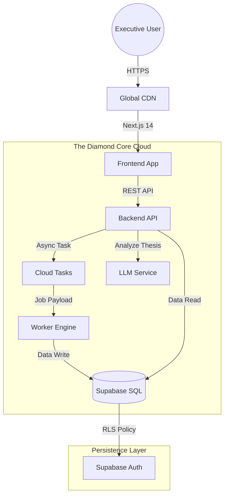

# VERTIV™ Architecture Blueprint 🏛️📐

**System Version**: 6.0  
**Pattern**: Modular Monolith on Cloud Run  

---

## 1. High-Level Diagram

---

## 2. Component Specifications

### 2.1 Backend (`apps/backend`)
*   **Role**: The Orchestrator.
*   **Tech**: FastAPI (Python 3.11).
*   **Responsibilities**:
    *   Auth Validation.
    *   Job Dispatch (to Worker).
    *   Data Retrieval (from DB).
    *   AI Prompt Construction.

### 2.2 Worker (`apps/worker`)
*   **Role**: The Quant.
*   **Tech**: Python 3.11 + Polars.
*   **Responsibilities**:
    *   `CashFlowEngine`: Vectorized DCF calculation.
    *   `RealOptionsEngine`: Stochastic path simulation.
    *   Payload Sanitization (handling `NaN`/`Infinity`).

### 2.3 Frontend (`apps/frontend`)
*   **Role**: The Interface.
*   **Tech**: Next.js 14 + Shadcn UI.
*   **Key Features**:
    *   **Wizard**: Multi-step state machine for data entry.
    *   **Dashboard**: Real-time visualization using Recharts.
    *   **PDF Generation**: Client-side rendering for "Deal Memos".

---

## 3. Security Model

### 3.1 Data Sovereignty (RLS)
We use Postgres **Row Level Security** to enforce isolation.
*   Policy: `CREATE POLICY "Select Own" ON simulations USING (auth.uid() = user_id);`
*   Effect: A user cannot physically query another user's deal, even if they hack the frontend.

### 3.2 Secrets Management
*   Secrets (DB Keys, API Keys) are injected at runtime via **Google Cloud Secret Manager**.
*   No secrets are stored in the git repository.

---

## 4. Scalability Strategy

*   **Stateless**: All containers are stateless.
*   **Auto-Scaling**: Cloud Run scales from 0 to N instances based on request load.
*   **Queue-Based**: Heavy math is offloaded to a queue, ensuring the API never blocks.

> *"Built to endure. Designed to scale."*
