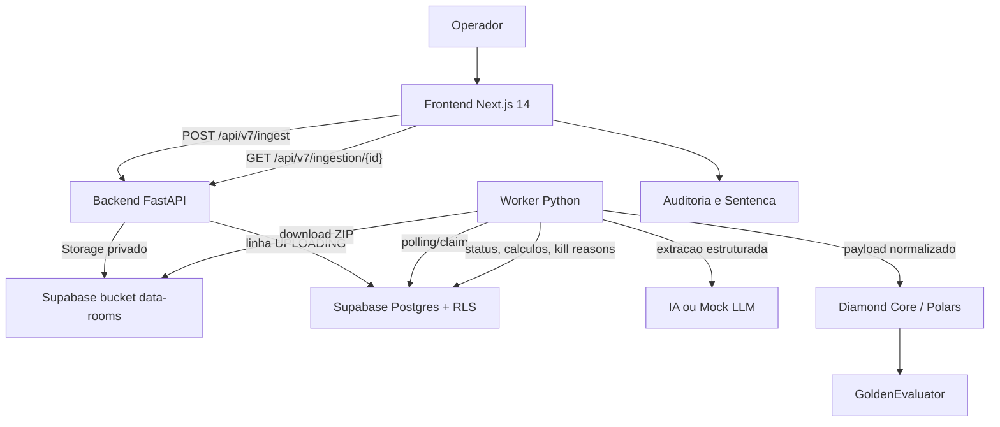

# VERTIV V7.0 Architecture

**Produto:** Tribunal Agentico de Risco Imobiliario
**Padrao:** monolito modular com frontend, FastAPI, worker Python, Supabase e Diamond Core/Polars
**Fluxo oficial:** ZIP Data Room -> IA extrai -> Diamond Core/Polars calcula -> GoldenEvaluator compara -> Sentenca de Capital

## Visao Geral

## Fronteiras de Responsabilidade

### Frontend (`apps/frontend`)

- Upload do Data Room ZIP.
- Leitura do status de ingestao.
- Exibicao de evidencias da IA, calculos Diamond Core, calibracao Golden e Sentenca de Capital.
- Acoes humanas: solicitar auditoria manual e confirmar sentenca.
- WebMCP apenas quando `NEXT_PUBLIC_WEBMCP_ENABLED=true`.

### Backend (`apps/backend`)

- Autenticacao JWT via Supabase.
- Validacao de upload ZIP.
- Gravacao no bucket `data-rooms`.
- Persistencia da ingestao em `data_room_ingestions`.
- API V7 de status e acoes humanas.
- Registro condicional de WebMCP quando `WEBMCP_ENABLED=true`.
- Rotas legadas de simulacao podem permanecer para compatibilidade.

### Worker (`apps/worker`)

- Consome ingestoes pendentes.
- Baixa o ZIP do Storage.
- Extrai texto e dados com mock ou provider LLM.
- Executa Diamond Core/Polars.
- Aciona GoldenEvaluator quando ha calibracao historica.
- Atualiza status, metricas, kill reasons e payloads auditaveis.

### Diamond Core

O Diamond Core e a camada deterministica de calculo. A IA nao substitui as regras financeiras: ela transforma documentos em dados estruturados para que o core calcule.

## Persistencia e Seguranca

- Supabase Auth fornece identidade do usuario.
- Postgres usa Row Level Security para isolar ingestoes por `user_id`.
- Storage usa o bucket privado `data-rooms`.
- O backend aceita cliente Supabase autenticado por JWT quando precisa preservar compatibilidade com RLS.
- Esta task nao altera RLS nem o Diamond Core.

## Estados de Ingestao

| Estado | Significado |
| --- | --- |
| `UPLOADING` | Upload aceito; aguardando worker |
| `INGESTING` | Worker processando documentos |
| `AUTONOMOUS_SENTENCED` | Sentenca automatica disponivel |
| `PENDING_HUMAN_AUDIT` | Operador pediu auditoria humana |
| `MANUAL_ASSISTED` | Ingestao exige apoio humano |
| `KILLED` | Regras de risco bloquearam continuidade |
| `FAILED` | Falha tecnica ou de processamento |

## Legado/Compatibilidade

V6 e o fluxo de entrada manual permanecem apenas como legado de calibracao, testes historicos e compatibilidade de rotas. O fluxo principal V7.0 e Data Room ZIP com auditoria e sentenca.
